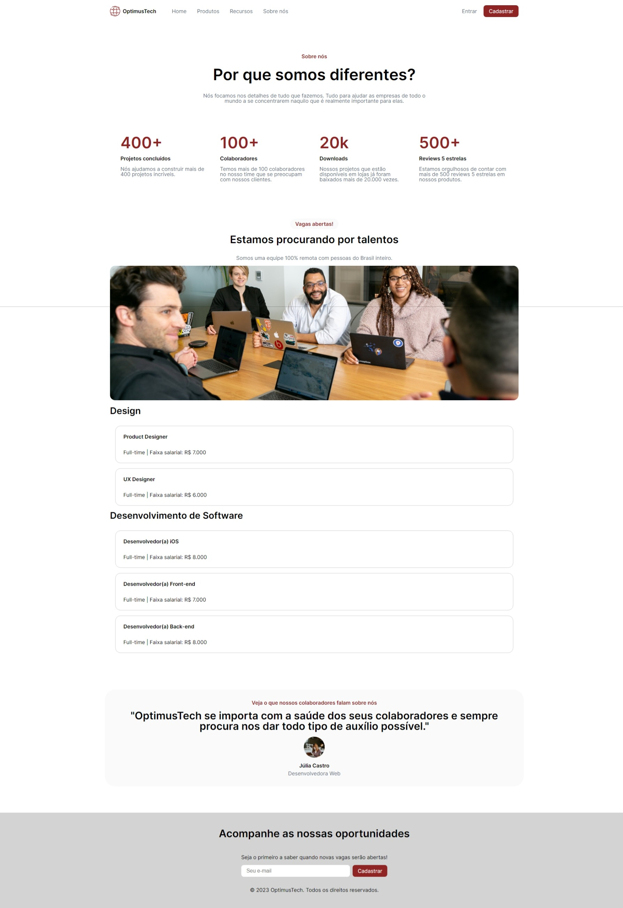

# Landing Page

Projeto proposto pela Giovanna Moeller (Desenvolvedora iOS & Web no Itaú) no Alura 7 Days of Code. [Clique aqui para abrir a página](https://diego-moreira8.github.io/alura-optimus-tech-landing-page/).

O objetivo era transformar [este projeto do Figma](https://www.figma.com/file/mm3MLozvUDGhDRTxSLlGL5/7daysOfCode-HTML-CSS?node-id=0%3A1) em código em 7 dias.

Nele pude praticar HTML e CSS puro.

Cerca de um ano depois revisei o código mantendo o objetivo da aula, que era HTML e CSS puros, e deixei a página mais responsiva.

